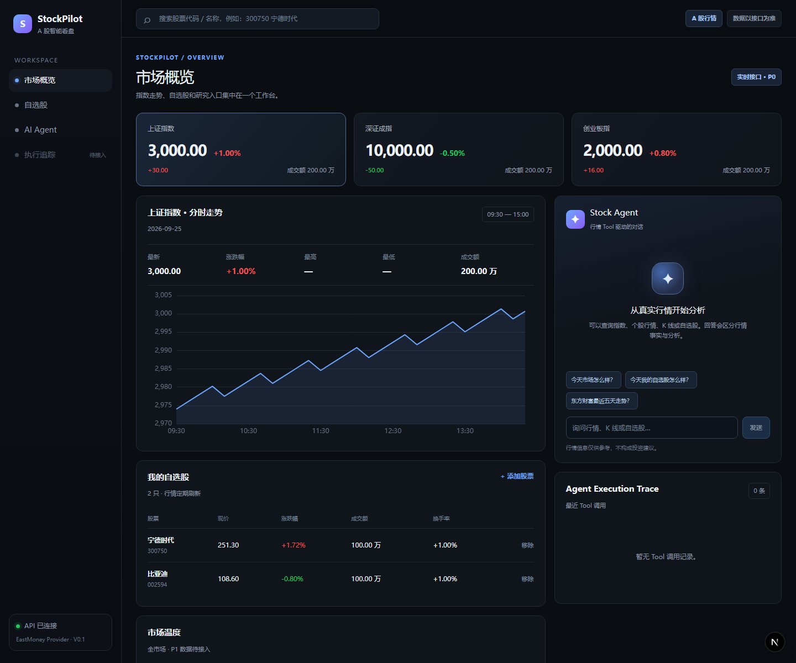
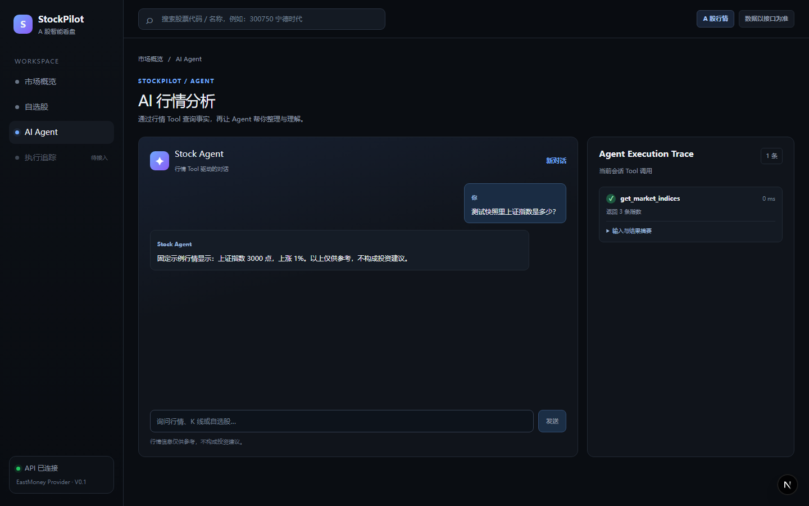
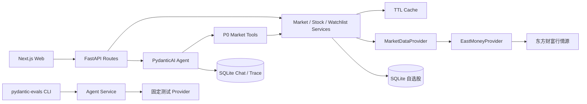

# StockPilot

StockPilot V0.1 是 A 股看盘与 AI 辅助分析应用。当前已完成 P0 行情数据链、REST API、Web 行情页面、核心 Agent 对话、Tool Trace 和 Agent Evaluation。

当前完整 V0.1 验收仍受东方财富 K 线源连接失败影响，实际通过项与阻断项见 [验收记录](docs/acceptance.md)。

## Quick Start

需要 Python 3.13、[uv](https://docs.astral.sh/uv/)、Node.js 和 npm。在仓库根目录先复制配置模板，再按需填写模型配置；真实密钥只放在 `backend/.env`：

```powershell
Copy-Item .env.example backend/.env
```

分别在两个终端启动：

```powershell
# 终端 1：后端
cd backend
uv sync
uv run uvicorn app.main:app --reload
```

```powershell
# 终端 2：前端
cd frontend
npm install
npm run dev
```

打开 [Dashboard](http://localhost:3000)、[Agent 工作台](http://localhost:3000/agent)；后端 [健康检查](http://127.0.0.1:8000/health) 应返回 `{"status":"ok"}`。若本机 `uv` 全局缓存目录权限不足，已安装依赖时可在 `backend/` 运行 `.\.venv\Scripts\python.exe -m uvicorn app.main:app --reload`。

| 环境变量 | 用途 | 默认或示例 |
|---|---|---|
| `MODEL_NAME` | Agent 模型名称 | 留空则禁用在线对话 |
| `MODEL_API_KEY` | 模型 API Key | 留空；仅填入 `backend/.env` |
| `MODEL_BASE_URL` | OpenAI 兼容 API 地址 | 留空使用模型提供方默认地址 |
| `DATABASE_URL` | SQLite 数据库连接 | `sqlite:///./stockpilot.db` |
| `CORS_ORIGINS` | 允许访问 API 的前端来源 | `http://localhost:3000` 等，JSON 数组 |
| `NEXT_PUBLIC_API_BASE_URL` | 前端连接的后端地址 | `http://localhost:8000`，在 `frontend/.env.local` 配置 |

## 界面预览

以下截图使用固定示例行情与测试模型，仅展示界面和数据流；**数字不是实时行情，回答不是 DeepSeek 在线输出**。





## 架构



行情读取沿 Route 或 Tool → Service → Provider 流动；Evaluation 使用固定测试 Provider，因此评测结果与真实行情源可用性分开记录。

## 启动后端

需要 [uv](https://docs.astral.sh/uv/)。在 `backend/` 目录运行：

```powershell
uv sync
uv run uvicorn app.main:app --reload
```

访问 `http://127.0.0.1:8000/health`，应返回 `{"status":"ok"}`。可将根目录 `.env.example` 复制为 `backend/.env` 配置环境变量；真实密钥只放在已忽略的 `backend/.env`，不要写入或提交 `.env.example`。

需要预先创建 SQLite 表时，在 `backend/` 目录运行：

```powershell
uv run python -c "from app.database.session import create_database_engine, init_db; init_db(create_database_engine())"
```

后端启动时会自动创建数据库表。可访问 `/docs` 查看 API 文档；当前提供指数及分时、基础市场概览、股票搜索、单只/批量行情、日/周 K 线和自选股增删查。行情响应包含 `stale` 标记；资金流、新闻、市场涨跌家数等 P1 能力尚未接入。

Agent 对话需在 `backend/.env` 中填写 `MODEL_NAME` 和 `MODEL_API_KEY`；使用 OpenAI 兼容服务时按需设置 `MODEL_BASE_URL`。未配置模型时页面会显示提示，聊天接口返回 503。四个核心 Tool 分别查询个股行情、日/周 K 线、三大指数和自选股；模型请求失败或行情源不可用时不生成模拟回答。Tool Trace 保存输入、结果摘要、成功/失败状态和耗时，可通过 `/api/agent/traces/recent` 与 `/api/agent/traces/{session_id}` 查询；不保存模型私有推理。聊天失败时可从响应头 `X-Agent-Session-ID` 取得会话 ID 查询失败 Trace。

2026-09-25 使用真实 DeepSeek 模型验证了指数 Tool 选择；配合固定测试行情完成回答与成功 Trace。连接真实东方财富行情源时返回 503，失败 Trace 已记录；真实行情的完整在线验收待数据源恢复后复验。

## 启动前端

需要 Node.js 和 npm。在 `frontend/` 目录运行：

```powershell
npm install
npm run dev
```

访问 `http://localhost:3000`。前端默认连接 `http://localhost:8000`，可参考 `frontend/.env.example` 设置 `NEXT_PUBLIC_API_BASE_URL`。首页提供三大指数、分时走势、搜索、自选股、Agent 对话和最近 Tool Trace；个股详情提供基础行情、日/周 K 线及预填问题入口。完整对话与当前会话 Trace 位于 `/agent`，会话消息保存在后端 SQLite，浏览器仅保存会话 ID。数据源不可用时会显示重试提示，若后端有最近成功缓存则标注旧数据。市场温度、资金流和新闻仍待接入。

## Agent Evaluation

在 `backend/` 配置好本地 `.env` 后运行：

```powershell
uv sync
uv run python ../evals/run_eval.py
```

可用 `--limit 2` 先运行两条冒烟 Case。24 条 Case 位于 `evals/datasets/`，覆盖单 Tool、多 Tool、自选股和股票比较。评测调用真实配置的模型，行情来自固定测试 Provider；不会访问真实东方财富数据或修改用户自选股。无模型配置时 CLI 输出 `SKIP`，不生成分数。输出包含 Tool Selection Accuracy、Argument Accuracy、Task Success Rate 和失败 Case；Tool 名称、次数与参数按严格匹配评分，任务成功还要求 Tool 成功且回答包含预期测试事实。

2026-09-26 实际运行结果（DeepSeek `deepseek-flash`，固定测试行情，24 条 Case）：Tool Selection **22/24**、Argument Accuracy **22/24**、Task Success **22/24**。失败的 `eastmoney_daily` 和 `catl_daily` 都正确调用了日 K Tool，但又额外调用了报价 Tool，因此严格评分未通过。模型输出可能变化，复验时以当次 CLI 结果为准；这组分数不代表真实东方财富行情链路的成功率。

## 检查

```powershell
cd backend; uv run pytest
cd ../frontend; npm run lint; npx tsc --noEmit; npm run build
```

## 免责声明

StockPilot 用于行情展示和技术演示，内容仅供参考，不构成投资建议、交易指令或收益保证。行情依赖第三方数据源，可能延迟、缺失或不可用；遇到数据源错误时请以可靠的交易渠道核实。截图中的行情与 Agent 回答为固定示例，不可作为实际投资决策依据。
